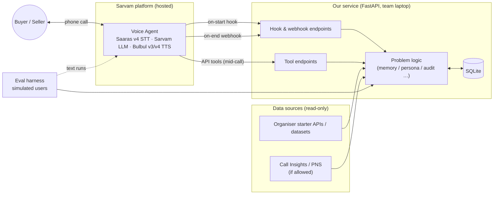

# 03 — Architecture & tools

> **Chosen problem: P4 — Seller-Fit Adaptive Voice Persona** ([P4 architecture](candidates/p4-persona-design/architecture.md)). This doc covers the **shared stack** every candidate builds on. Problem-specific designs live in [candidates/](candidates/README.md). Diagrams are Mermaid and render on GitHub.

## Shared architecture

Every candidate is the same shape: a **Sarvam voice agent** talking to the user, backed by **our own service** that gives it data before the call, handles tools during it, and receives results after it.



### Sarvam integration points (verified in docs, 8 Oct 2026)

| Point | When | What we can do |
|---|---|---|
| Agent variables | Set per call (outbound API `agent_variables`, campaign CSV, inbound telephony metadata) | Pass IDs (e.g. GLID) and context into the prompt |
| On-start hook | Call start, before the agent speaks | Our API returns data mapped into agent variables (profiles, flags, context) |
| API tools | During the call | Agent calls our endpoints; "save reply into variables"; call-context variables (phone, transcript, interaction ID) |
| Output variables | After the call | LLM extracts typed fields (String / Enum) we define |
| On-end webhook | After the call | We receive transcript, `output_agent_variables`, `final_agent_variables`, timestamps |
| Language | Whole call | Start language, auto-switch during call, voice per starting language |

Gaps: no documented chat/WhatsApp channel, no documented mid-call voice/pace/pitch change, multi-agent not yet available. Details: [research/sarvam-platform-notes.md](../research/sarvam-platform-notes.md).

## Tech stack

| Layer | Tool | Why | Alternative |
|---|---|---|---|
| Voice agent | Sarvam Voice Agents (indus.sarvam.ai) | Required; gives an agent ID; handles telephony, STT/TTS, language | LiveKit / Pipecat + Sarvam APIs — more control, much more work |
| STT | Saaras v4 | Current GA model on Voice Agents | Saaras v3 |
| TTS | Bulbul v3 / v4 | v4 available on Voice Agents since 6 Oct | — |
| LLM | Sarvam LLM (`sarvam-105b` or what the event provides) | Required stack; Indic languages | — |
| Backend | Python 3.11 + FastAPI + Uvicorn | Fastest to build; one process | Node/Express |
| Storage | SQLite | One file, no infra, data stays local | Postgres — not needed at demo scale |
| Templates | Jinja2 | Deterministic output; LLM only for wording | — |
| Tunnel | ngrok or cloudflared | Sarvam must reach our laptop over HTTPS | Small cloud VM — conflicts with "data stays on premises" |
| Second channel (if needed) | Minimal web page + FastAPI + Sarvam LLM | Sarvam has no documented chat channel | WhatsApp sandbox — setup risk |
| Eval | Python + Sarvam LLM as simulated user | Scaled, repeatable measurement | Manual calls only |
| Repo / tracking | GitHub (private) + docs in `docs/` | Single source of truth | — |

## Repo structure (from Day 1)

```
Murmur/
├── docs/                 # this documentation
├── research/             # dated findings with sources
├── service/              # FastAPI app: hooks, tools, problem logic
│   ├── app.py
│   ├── hooks.py          # on-start, on-end
│   ├── tools.py          # mid-call API tools
│   └── core/             # problem-specific logic
├── agent/                # Sarvam agent export: prompt, variables, tool configs
├── eval/                 # simulated users, runs, reports
├── samples/              # synthetic / masked sample outputs
├── .env.example
└── skills.md             # submission item
```

## Cross-cutting rules

- **Security:** shared-secret header on every hook/tool endpoint; API keys in `.env`; repo private.
- **Privacy:** raw data stays on the laptop; no names/phones in prompts or files; what may go to Sarvam is a Day-1 gate question.
- **Reliability:** hook endpoints only read precomputed data (target < 300 ms); webhook handling is idempotent on `interaction_id`; record the demo video early in case the tunnel fails live.
- **Observability:** log every hook/tool/webhook call with `interaction_id` and latency — this also produces the freshness/latency numbers for the approach note.

## Candidate-specific architecture

| Candidate | What it adds to the shared stack | Doc |
|---|---|---|
| P2 — Global Context | Event store, context builder, `buyer.md`/`seller.md`, web chat as second channel | [architecture](candidates/p2-global-context/architecture.md) |
| **P4 — Seller-Fit Adaptive Voice Persona (chosen)** | Persona engine, 3 agent voice variants, adapt tool, write-back, Sarvam Tests eval | [architecture](candidates/p4-persona-design/architecture.md) |
