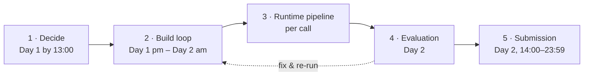
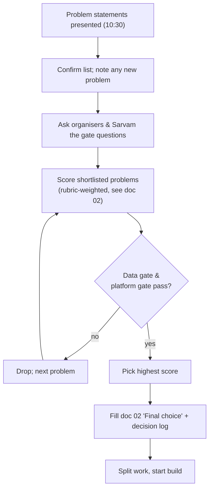
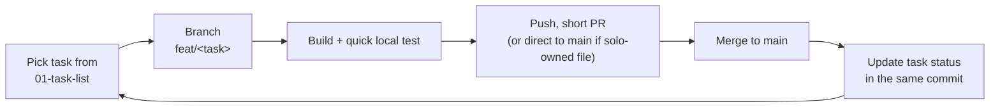
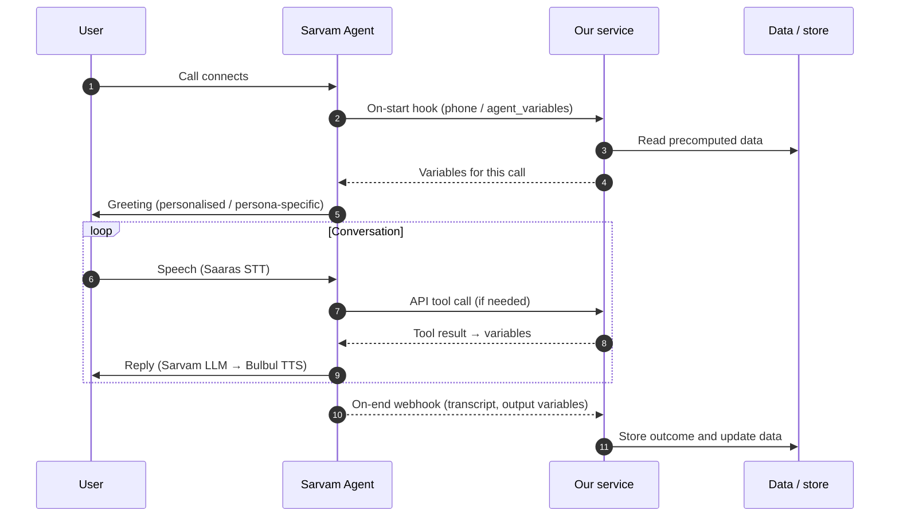
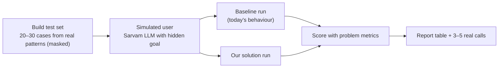
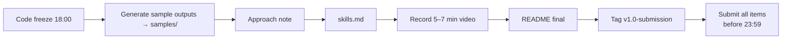

# 04 — Pipelines

> **Chosen problem: P4 — Seller-Fit Adaptive Voice Persona** ([P4 pipelines](candidates/p4-persona-design/pipelines.md)). This doc covers the pipelines **every candidate** runs through. Data pipelines specific to a problem are in its candidate folder.

## Overview

---

## 1 · Decision pipeline (Day 1, 10:30–13:00)

Output: chosen problem, owner per component, logged in [05-decision-log](05-decision-log.md).

## 2 · Build loop (how we work)

Rules:

- `main` must always run. Small commits, clear messages (`feat:`, `fix:`, `docs:`).
- Every decision → one line in the decision log. Every finding → `research/` with date and source.
- Every 3–4 hours: one end-to-end run through the runtime pipeline.

## 3 · Runtime pipeline (per call — same for every candidate)

| Stage | Target |
|---|---|
| On-start hook response | < 300 ms |
| Tool call response | < 800 ms |
| Webhook → data updated | < 60 s |

## 4 · Evaluation pipeline

Metrics come from the official problem statement; P2's are in [candidates/p2-global-context/pipelines.md](candidates/p2-global-context/pipelines.md#p5--evaluation-offline). Always report a **baseline vs ours** delta — it drives Business Impact (25%).

## 5 · Submission pipeline (Day 2)

| Item | Owner | Source |
|---|---|---|
| Demo video (5–7 min) | Non-tech member + Pratik | Demo script |
| Approach note | Pratik + non-tech member | docs 02–04 + eval report |
| Sarvam agent ID / live link | Pratik | Sarvam console |
| Code + README | Engineer + Pratik | repo |
| `skills.md` | Non-tech member | agent prompts + learnings |
| Sample outputs | Engineer | `samples/` |

## Candidate-specific data pipelines

| Candidate | Pipelines | Doc |
|---|---|---|
| P2 — Global Context | Historical ingest → context build → write-back → serve → evaluation | [pipelines](candidates/p2-global-context/pipelines.md) |
| **P4 — Seller-Fit Adaptive Voice Persona (chosen)** | Insight mining → persona assignment → call & adapt → write-back → evaluation | [pipelines](candidates/p4-persona-design/pipelines.md) |
