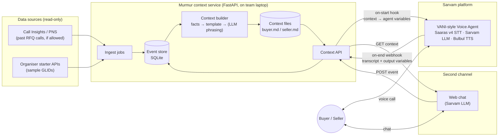
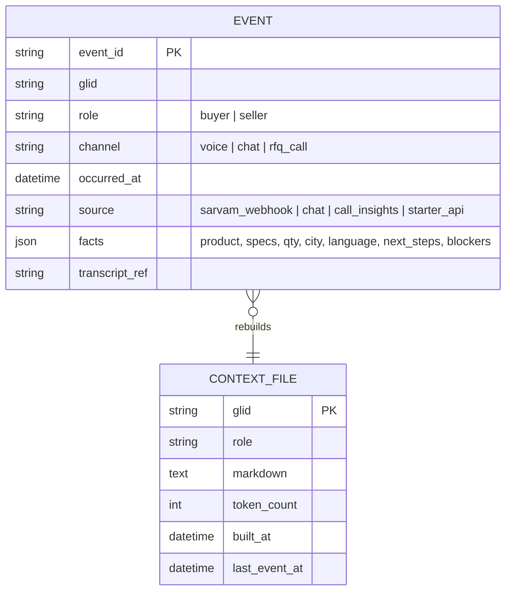
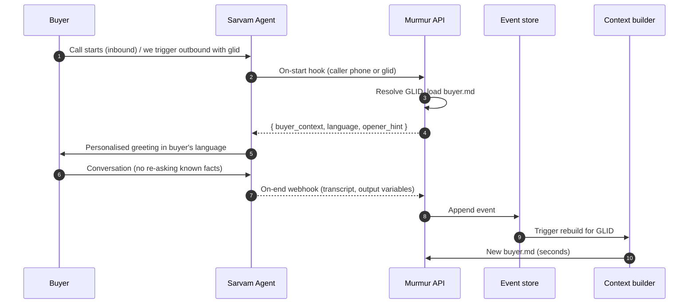
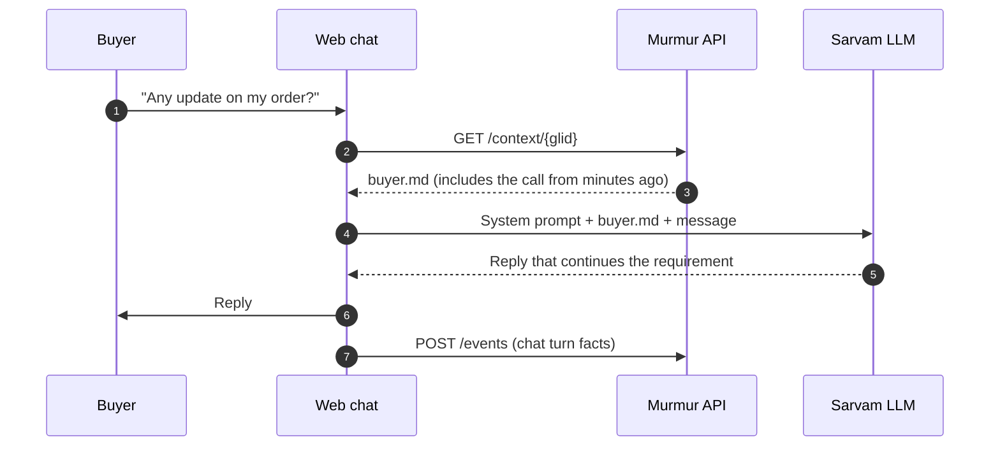

# P2 — Global Context: architecture (candidate, not final)

> Candidate design for Problem 2. Used only if P2 is chosen at the Day-1 gate. Shared stack: [../../03-architecture.md](../../03-architecture.md).

Diagrams are Mermaid and render on GitHub.

## System overview

All channels read from **one** context API and write to **one** event store. That is what makes memory cross-channel.

## Components

| Component | Responsibility | Tech |
|---|---|---|
| Ingest jobs | Pull history for sample GLIDs from allowed sources; normalise into events | Python scripts |
| Event store | Append-only log of interactions: channel, GLID, timestamp, facts, transcript ref | SQLite (single file; good enough for demo scale) |
| Context builder | Events → structured facts → `buyer.md` / `seller.md`; runs on every new event | Python, Jinja2 templates, optional Sarvam LLM for phrasing |
| Context API | Serve files, accept events, act as Sarvam hook/webhook target | FastAPI + Uvicorn |
| Tunnel | Public HTTPS URL so Sarvam can reach the laptop | ngrok or cloudflared |
| Voice agent | Conversation, language handling, uses context, extracts output variables | Sarvam Voice Agents (indus.sarvam.ai): Saaras v4, Bulbul v3/v4, Sarvam LLM |
| Chat channel | Text conversation on the same memory | Minimal web page + FastAPI route calling Sarvam chat completion |
| Eval harness | Simulated users, cold vs memory, scoring | Python; Sarvam LLM as the simulated user |

## Tools and why

| Choice | Why | Alternative considered |
|---|---|---|
| Sarvam Voice Agents (hosted) | Required by the hackathon; gives an agent ID for submission; handles telephony, STT/TTS, language switching | LiveKit/Pipecat + Sarvam APIs — more control, much more work, may not satisfy "agent ID" |
| On-start hook + agent variables | Documented way to inject per-call data before the agent speaks | API tool on first turn — adds a visible delay and an extra LLM step |
| On-end webhook | Documented call-completion event with transcript + output variables → freshness in seconds | Polling transcripts from analytics — slow, not documented as an API |
| FastAPI + SQLite | Fastest to build, one process, no infra; data stays on the laptop | Postgres/Redis — not needed at demo scale |
| Markdown files | Readable by any LLM and any human; matches the problem statement (`buyer.md` / `seller.md`) | JSON profile — better for code, worse for prompts and judges; we keep JSON facts internally and render markdown |
| Templates first, LLM second | Facts stay correct and dated; LLM only rewrites wording | LLM summarises raw transcripts — risk of invented facts |

## Data model

Freshness = `built_at − last_event_at` (build lag) and `last_event_at − conversation end` (delivery lag).

## Sequence: voice call with memory

## Sequence: resume on chat

## Context API (draft contract)

| Method | Path | Used by | Notes |
|---|---|---|---|
| `POST` | `/hooks/sarvam/on-start` | Sarvam on-start hook | Input: caller phone / variables. Output: flat fields mapped to agent variables |
| `POST` | `/hooks/sarvam/on-end` | Sarvam webhook | Payload: `interaction_id`, `user_phone_number`, `interaction_transcript[]`, `output_agent_variables`, `final_agent_variables`, timestamps |
| `GET` | `/context/{glid}?role=buyer` | Chat, eval, judges | Returns markdown + metadata |
| `POST` | `/events` | Chat, ingest | Append an event; triggers rebuild |
| `GET` | `/health` | Everyone | Liveness |

Field names for the on-start hook response are not documented publicly — confirm on Day 1 (see [research/sarvam-platform-notes.md](../../../research/sarvam-platform-notes.md)).

## Identity: phone → GLID

Call Insights has no phone numbers, and the inbound hook gives us the caller phone. For the demo:

- **Outbound:** trigger calls via the Sarvam outbound API with `agent_variables.glid` set → no lookup needed.
- **Inbound:** a small demo mapping table (team phones → sample GLIDs).
- **Production:** IndiaMART's own phone ↔ GLID lookup replaces the table (out of scope).

## Security and privacy

- Context service runs on a team laptop on the IndiaMART network; raw data stays local.
- Whether per-GLID context may be sent to Sarvam is an open gate question; if not, demo on synthetic GLIDs built from aggregate patterns.
- No names/phones in context files. API keys in `.env`. Tunnel URL protected with a shared secret header.

## Known risks

| Risk | Mitigation |
|---|---|
| Sarvam has no chat/WhatsApp channel | Own web chat on Sarvam LLM (planned) |
| On-start hook latency delays the greeting | Precompute files; hook only reads; target < 300 ms |
| Laptop/tunnel drops during judging | Record the video early; keep a fallback recording |
| Call Insights not allowed | Starter APIs + synthetic histories; design and metrics still stand |
