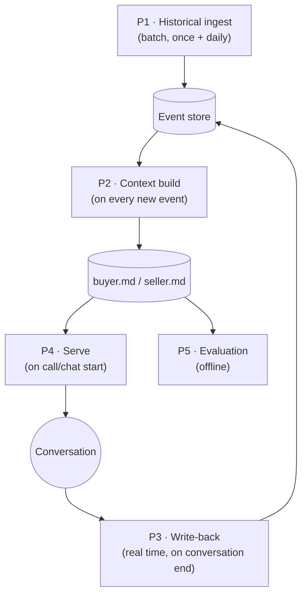
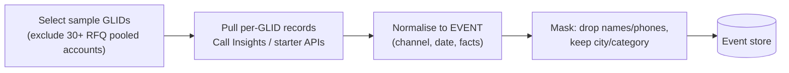
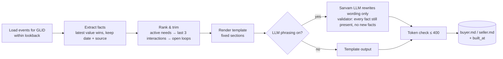
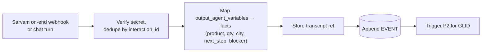
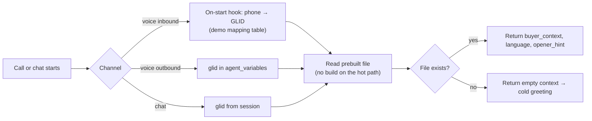
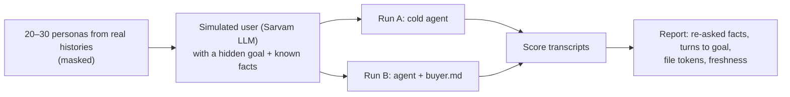

# P2 — Global Context: pipelines (candidate, not final)

> Candidate design for Problem 2. Used only if P2 is chosen at the Day-1 gate. Shared stack: [../../03-architecture.md](../../03-architecture.md).

If P2 is chosen, it has five pipelines. Two are batch (history), two are real time (conversations), one is offline (evaluation).



---

## P1 — Historical ingest (batch)

Gives the file its older context: language, categories, past needs, blockers, sellers contacted.



| Item | Value |
|---|---|
| Trigger | Once at setup; re-run daily in production |
| Input | Call Insights per-call fields (products/specs/qty, quoted prices, call_purpose, deal_readiness, outcome, intent, blockers, buyer questions, next steps, language, city, persona); starter APIs |
| Lookback | Buyers: 7–14 days in detail + compact profile beyond. Sellers: 30 days aggregated |
| Output | Events in SQLite |
| Not used | `callbacks` (not extracted since 11 Sep); readiness/blocker trends (extraction changed 4, 23, 30 Sep) |

## P2 — Context build

Turns events into the file. Runs on every new event for that GLID.



Rules:

- Every fact has a date (`2026-10-09`) and source (`call`, `chat`, `rfq`).
- Conflicts: newest wins; older value kept only if still relevant ("earlier asked 200 kg, now 500 kg").
- Facts older than the lookback drop to the compact profile (language, city, categories).
- If the LLM output fails validation, ship the template output.

`buyer.md` shape:

```markdown
# Buyer {glid} · updated 2026-10-09 14:32 IST
## Who
City: Kanpur · Type: B2B (trader) · Language: Hindi (Hinglish ok)
## Active needs
- HDPE granules, blow-moulding grade, 500 kg, wants price ≤ ₹110/kg — 2026-10-09 (call)
## Last interactions
- 2026-10-09 call with VANI — gave specs and qty; waiting for quotes
- 2026-10-08 RFQ call with 2 sellers — price too high (blocker)
## Open loops
- Send 2–3 seller quotes under ₹110/kg
## Don't re-ask
Product, grade, quantity, city, budget
```

## P3 — Write-back (real time)

Keeps the file fresh within seconds of a conversation ending.



| Item | Value |
|---|---|
| Trigger | Sarvam call-completion webhook; every chat exchange |
| Idempotency | `interaction_id` unique; retries are no-ops |
| Facts source | Sarvam output variables (LLM-extracted at call end, typed String/Enum) — preferred over parsing raw transcripts |
| Target latency | Webhook received → file rebuilt < 60 s (expected: a few seconds) |

## P4 — Serve (on call / chat start)



Prompt rules the agent follows:

- Use the context; confirm stale facts (> 7 days) instead of assuming them.
- Never read the file out; never reveal other sellers' names or prices unless the user asks.
- If the caller says it's not them / wrong need → drop memory for this call.

Target: hook response < 300 ms.

## P5 — Evaluation (offline)

Proves the lift with numbers for the demo and approach note.



| Metric | Definition |
|---|---|
| Re-ask rate | Known facts the agent asked again ÷ known facts |
| Turns to goal | Agent turns until the requirement is complete |
| Opening relevance | Did the first agent turn reference the active need? (yes/no) |
| File size | Tokens per file (p50, max) |
| Freshness | Conversation end → file rebuilt (p50, p95) |

Plus 3–5 real voice calls by the team as a sanity check; text simulation is the scaled measurement.
