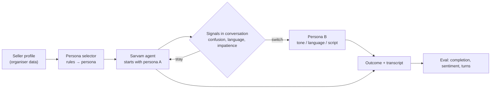

# P4 — Persona Design (fallback candidate, sketch)

> Built only if chosen at the Day-1 gate. Based on the hackathon deck and Sarvam docs as of 8 Oct 2026; the official statement on Day 1 overrides this.

## Idea

VANI uses one persona for every seller today. P4 asks for personas tuned to the seller (e.g. by segment, language, experience) and a **live switch mid-call** when the conversation shows a different persona would work better.

## What Sarvam supports (from [research/sarvam-platform-notes.md](../../research/sarvam-platform-notes.md))

| Need | Hosted Sarvam agent | Notes |
|---|---|---|
| Different wording / tone mid-call | Yes | Prompt instructions, multi-state agents |
| Language switch mid-call | Yes | "Switch language during call" follows the caller |
| Voice chosen per starting language | Yes | Per-language voice selection (Sept 2026) |
| Voice / speed / pitch change mid-call | **Not documented** | Speaker fixed for the call; speed/pitch are agent-level sliders |
| Multi-agent handoff | Not available yet | Multi-state is the current option; Sarvam plans to replace it |

So a hosted-agent build can switch **wording, tone and language** live; switching **voice, pace or pitch** probably needs a code-first pipeline (LiveKit or Pipecat + Saaras/Bulbul APIs), which is much heavier and may not satisfy the "Sarvam agent ID" submission item.

## Sketch

## Strengths and weaknesses

| Strengths | Weaknesses |
|---|---|
| Strongest voice demo (Voice Experience 20%) | No data edge — seller data comes from organisers, same for all teams |
| Data provided → no access risk | "Evidence from past calls" can't be causal: VANI used one persona historically |
| Non-tech member can own persona specs and objection playbook | True voice switching may need a code-first build |

## Open questions for Day 1

1. Can speaker / speed / pitch change mid-call by tool, API or handoff?
2. Is multi-agent available to hackathon teams?
3. Does a LiveKit/Pipecat build count for the "agent ID" item?
4. What seller data do organisers provide, and how many personas are expected?
