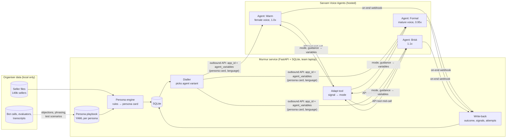
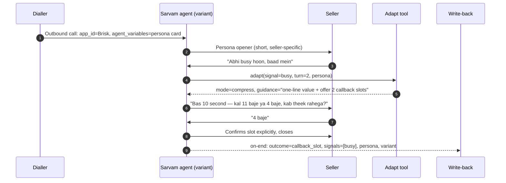

# P4 — Seller-Fit Adaptive Voice Persona: architecture

> Built on the shared stack in [03-architecture](../../03-architecture.md). Sarvam capabilities checked 8 Oct 2026 ([research/sarvam-platform-notes.md](../../../research/sarvam-platform-notes.md)); re-confirm with Sarvam on Day 1.

## Key platform constraint (drives the design)

| Can change… | Before the call | During the call |
|---|---|---|
| Voice (speaker) | Yes — per agent, or per starting language | **No** (fixed for the call) |
| Pace / pitch | Yes — per agent (sliders) | **No** on the hosted agent |
| Language | Yes — `initial_language_name` | **Yes** — auto switch / language tool |
| Wording, tone, script, mode | Yes — `agent_variables`, prompt | **Yes** — states + variables written by tools |
| Which agent handles the call | Yes — `app_id` / `app_version` per outbound call | No (no agent-to-agent handoff yet) |

**So:** persona = (agent variant for voice + pace) × (persona card in variables for tone/script) chosen **before** the call; live adaptation = **mode + language** changes **during** the call. Changing voice mid-call is deliberately out of scope on the hosted agent (it would need a LiveKit/Pipecat pipeline — cut list item 1).

## System overview



## Components

| Component | Responsibility | Tech |
|---|---|---|
| Persona engine | Seller row → persona id + overlays → persona card (≤ 250 tokens): voice variant, formality, opener, hook, pitch cap, objection lines, language, attempt rule | Python rules + Jinja2; Sarvam LLM only to phrase the opener/brief |
| Persona playbook | One YAML per persona: tone, openers (A/B), hooks, objection replies, booking style, stop rules | YAML in repo (owned by the non-tech member) |
| Agent variants | 3 Sarvam agents sharing one prompt/flow, differing only in speaker + pace (Warm / Formal / Brisk) | Sarvam Voice Agents, Bulbul v3/v4, Saaras v4 |
| Conversation flow | States: Open → Purpose/Value → Ask → Handle objection → Book slot → Confirm → Close; plus Exit | Multi-state agent (or single-prompt with mode variable if states are limiting) |
| Adapt tool | HTTP tool the agent calls when it detects a signal; returns `mode` + one-line guidance, saved into variables | FastAPI endpoint; keyword + LLM classifier |
| Dialler | Chooses variant + builds `agent_variables`; triggers outbound calls (demo: team phones) | Sarvam outbound API |
| Write-back | Stores outcome (output variables), signals, attempt count; feeds next-attempt policy | On-end webhook → SQLite |
| Demand hook (stretch) | Real category demand from Call Insights (RFQ data) for the opener, e.g. "~1,500 buyers asked for corrugated boxes last month"; category/state level only | Call Insights connector or CLI, cached per MCAT |
| Eval harness | Simulated sellers from real objection/transcript patterns; baseline vs seller-fit | Sarvam Tests (AI user + judge) + our scoring script |

## Persona card (what goes into `agent_variables`)

```yaml
persona_id: established_enterprise
voice_variant: formal          # selects app_id
language: Hindi                # initial_language_name
formality: high                # "aap", "sir/ma'am", no slang
pitch_cap_turns: 2
opener: "Namaste sir, IndiaMART se. Aapki {category} listing par aa rahi enquiries ke baare mein 1 minute baat kar sakte hain?"
value_hook: "account manager can review where enquiries are being missed"
booking_style: offer_two_specific_slots
attempt_no: 1
flags: [none]
do_not: ["long company intro", "repeat the pitch after a no"]
```

## Adaptation sequence



## Why not alternatives

| Option | Verdict | Reason |
|---|---|---|
| One agent, persona only in prompt | Partial | Can't vary voice or pace → loses the most audible persona dimension |
| One agent per persona (6+) | Too many | Six prompts to keep in sync; voice/pace only needs 3 variants |
| **3 voice variants × persona card in variables** | **Chosen** | Voice + pace per persona, one shared flow, tone/script per seller |
| LiveKit/Pipecat code-first with mid-call voice switch | Stretch only | Real voice switching, but heavy build, latency risk, may not count as "Sarvam agent ID" |

## Risks

| Risk | Mitigation |
|---|---|
| Multi-state end-of-life / limits | Keep a single-prompt fallback driven by a `mode` variable |
| Tool call adds latency mid-call | Keyword fast-path in the prompt; tool only for ambiguous cases; target < 800 ms |
| Over-personalisation sounds creepy | Use business facts only (category, city, tenure); never personal data |
| Persona effect not provable from history | Say so; measure in simulation; propose a production A/B design |
| Organiser data has real names | Data stays local, git-ignored; demo with synthetic seller cards |
