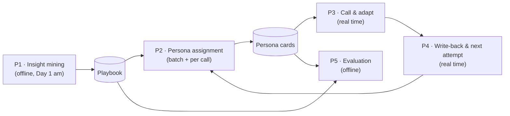
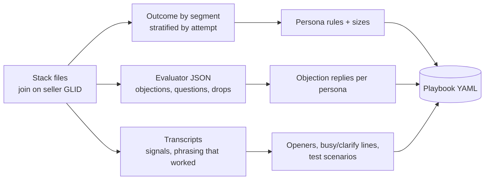
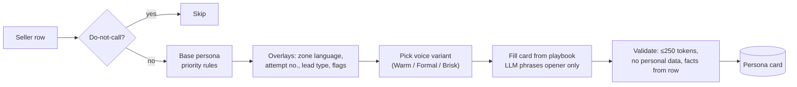
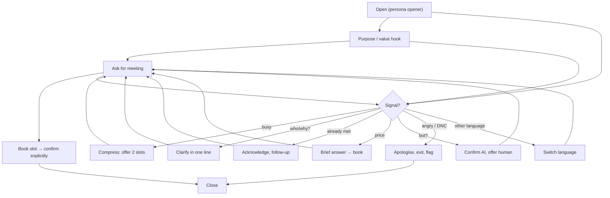
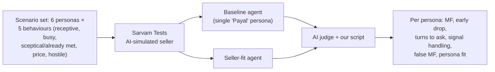

# P4 — Seller-Fit Adaptive Voice Persona: pipelines

> Problem-specific pipelines on top of the shared ones in [04-pipelines](../../04-pipelines.md).

## P1 — Insight mining (organiser data → playbook)

- Done once on Day 1 morning (exploratory version already in [research/ps07-data-analysis.md](../../../research/ps07-data-analysis.md)).
- Output contains no seller names; quotes are paraphrased.

## P2 — Persona assignment

Rules (from the data): established (≥₹1.5 Cr / Ltd / 50+ products) → new (GST ≤2y) → retailer → manufacturer → service → trader/other. Attempt ≥4 without a requested callback → don't dial.

## P3 — Call & adapt (per call)

Targets: first bot turn ≤ 6 s; adapt tool < 800 ms; no meeting logged without an explicit "yes" + slot.

## P4 — Write-back & next attempt

| Step | Detail |
|---|---|
| Trigger | Sarvam on-end webhook (`final_agent_variables`, `output_agent_variables`, transcript) |
| Store | outcome (meeting / callback slot / not interested / dropped / DNC), signals seen, persona, variant, attempt no. |
| Next attempt | callback slot → call at that time with "as promised" opener; dropped early → change opener variant; NI ×2 or attempt ≥4 → stop |
| Idempotent | keyed by `interaction_id` |

## P5 — Evaluation

- 30 scenarios × 3 runs each × 2 agents ≈ 180 simulated calls; plus 4–6 real team calls.
- Report deltas with n and say clearly that simulation ≠ field result; propose a production A/B (persona vs control, stratified by attempt and lead type, MF as primary metric).
